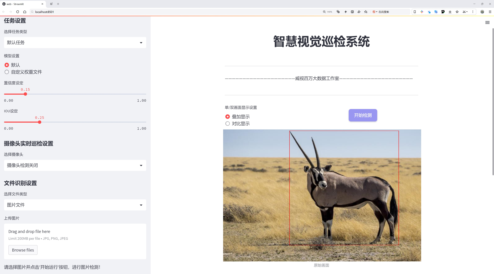
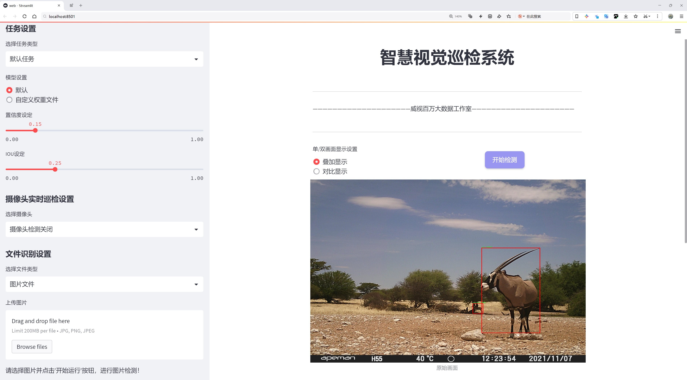
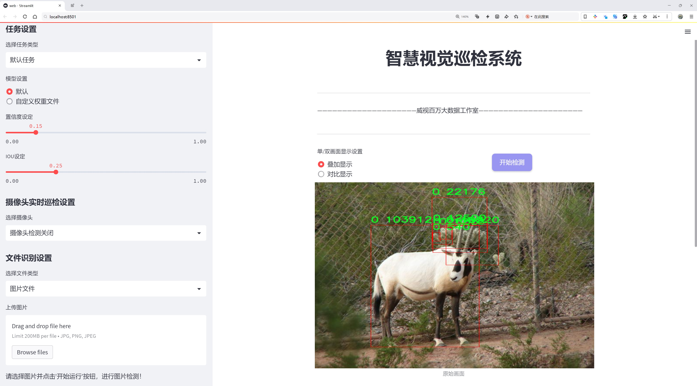
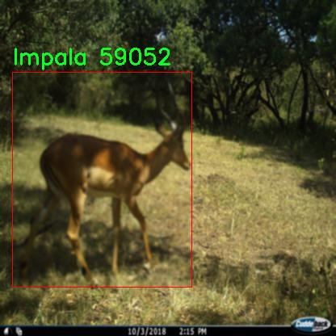
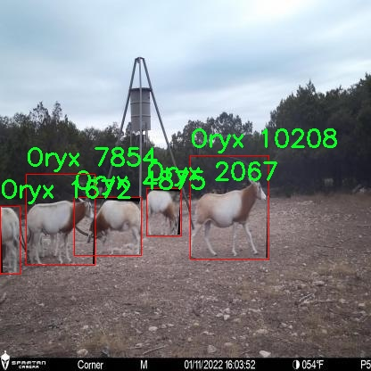
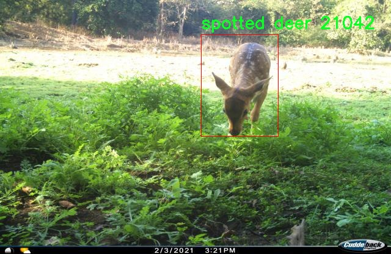
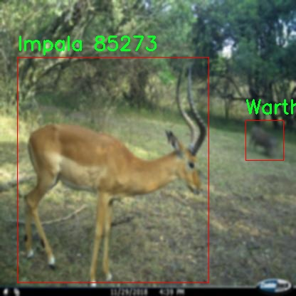
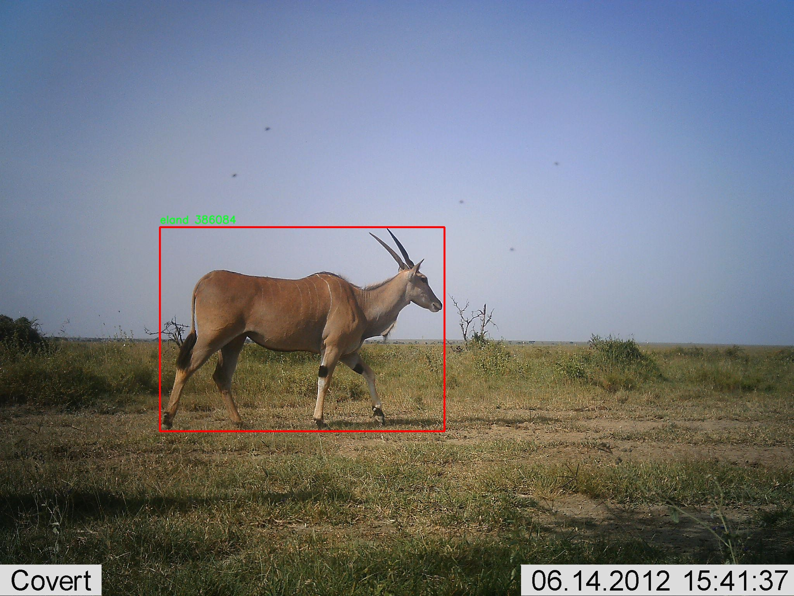

# 羚羊种类检测系统源码分享
 # [一条龙教学YOLOV8标注好的数据集一键训练_70+全套改进创新点发刊_Web前端展示]

### 1.研究背景与意义

项目参考[AAAI Association for the Advancement of Artificial Intelligence](https://gitee.com/qunmasj/projects)

项目来源[AACV Association for the Advancement of Computer Vision](https://kdocs.cn/l/cszuIiCKVNis)

研究背景与意义

在全球生态环境变化与人类活动日益加剧的背景下，野生动物的保护与管理成为了亟待解决的重要课题。羚羊作为草原生态系统中的重要组成部分，其种类繁多、分布广泛，承载着丰富的生态和文化价值。然而，随着栖息地的破坏、气候变化及人类活动的干扰，羚羊种群面临着生存威胁，许多种类的数量正在急剧下降。因此，建立一个高效、准确的羚羊种类检测系统，对于羚羊的保护、监测及管理具有重要的现实意义。

近年来，计算机视觉技术的快速发展为野生动物监测提供了新的解决方案。特别是基于深度学习的目标检测算法，如YOLO（You Only Look Once）系列，因其高效性和准确性在物体检测领域得到了广泛应用。YOLOv8作为该系列的最新版本，具备了更强的特征提取能力和实时检测性能，适合于复杂环境下的野生动物监测。通过对YOLOv8进行改进，结合特定的羚羊种类数据集，可以显著提升羚羊种类的检测精度和速度，为生态保护提供有力的技术支持。

本研究基于一个包含1700张图像和31个羚羊种类的丰富数据集，旨在开发一个改进的YOLOv8羚羊种类检测系统。该数据集涵盖了多种羚羊及其栖息环境，具有较高的多样性和代表性，能够有效支持模型的训练与验证。通过对数据集的深入分析，我们可以识别出不同羚羊种类的特征，从而为模型的优化提供依据。此外，研究还将探讨如何通过数据增强、迁移学习等技术手段，进一步提升模型的泛化能力和鲁棒性。

本研究的意义不仅在于技术层面的创新，更在于其对羚羊保护工作的推动作用。通过建立高效的羚羊种类检测系统，能够实现对羚羊种群的实时监测与评估，为保护措施的制定提供科学依据。同时，该系统还可以应用于生态旅游、教育宣传等领域，提升公众对羚羊及其栖息环境的关注与保护意识。

综上所述，基于改进YOLOv8的羚羊种类检测系统的研究，既是对深度学习技术在生态保护领域应用的探索，也是对羚羊保护工作的重要贡献。通过本研究，我们期望能够为羚羊的保护与管理提供更为精准和高效的技术手段，助力于生态环境的可持续发展。

### 2.图片演示







##### 注意：由于此博客编辑较早，上面“2.图片演示”和“3.视频演示”展示的系统图片或者视频可能为老版本，新版本在老版本的基础上升级如下：（实际效果以升级的新版本为准）

  （1）适配了YOLOV8的“目标检测”模型和“实例分割”模型，通过加载相应的权重（.pt）文件即可自适应加载模型。

  （2）支持“图片识别”、“视频识别”、“摄像头实时识别”三种识别模式。

  （3）支持“图片识别”、“视频识别”、“摄像头实时识别”三种识别结果保存导出，解决手动导出（容易卡顿出现爆内存）存在的问题，识别完自动保存结果并导出到tempDir中。

  （4）支持Web前端系统中的标题、背景图等自定义修改，后面提供修改教程。

  另外本项目提供训练的数据集和训练教程,暂不提供权重文件（best.pt）,需要您按照教程进行训练后实现图片演示和Web前端界面演示的效果。

### 3.视频演示

[3.1 视频演示](https://www.bilibili.com/video/BV19Z1kYAE19/)

### 4.数据集信息展示

##### 4.1 本项目数据集详细数据（类别数＆类别名）

nc: 33
names: ['0', '2', 'Blackbuck', 'Fallow', 'Giraffe', 'Impala', 'Male_kudu', 'Male_nyala', 'Oryx', 'Sable', 'Warthog', 'Waterbuck', 'Whitetail', 'Wildebeest', 'Zebra', 'alageyik', 'antelope', 'buffalo', 'ceylan', 'eland', 'giraffe', 'impala', 'kgeyik', 'kudu', 'nilgai', 'nilgay', 'oryx', 'oryx_child', 'oryx_herd', 'spotted deer', 'springbok', 'thomson', 'zebra']


##### 4.2 本项目数据集信息介绍

数据集信息展示

在本研究中，我们采用了名为“Antelope detection”的数据集，以训练和改进YOLOv8模型在羚羊种类检测系统中的表现。该数据集包含33个类别，涵盖了多种羚羊及相关物种，提供了丰富的样本和多样化的特征，使得模型能够更准确地识别和分类不同种类的羚羊。这些类别不仅包括常见的羚羊种类，如黑buck（Blackbuck）、斑马（Zebra）和大羚羊（Giraffe），还涵盖了其他相关物种，如水牛（Buffalo）和春羚（Springbok），这为模型的训练提供了广泛的视角和多样的样本。

数据集中包含的类别信息极为丰富，其中包括一些特定的羚羊种类，如雄性库杜（Male_kudu）、雄性尼亚拉（Male_nyala）和大羚羊（Oryx），这些物种在生态系统中扮演着重要的角色，具有独特的生物学特征和行为模式。此外，数据集还包含了如斑点鹿（Spotted deer）和汤姆逊羚羊（Thomson）等其他物种，这些物种的加入不仅增加了数据集的复杂性，也为模型提供了更多的学习机会，以提高其泛化能力。

数据集的多样性体现在其样本的多样性和场景的多样性上。每个类别下的样本均来源于不同的环境和条件，包括不同的光照、天气和背景，这些因素都会影响模型的识别效果。因此，数据集的设计考虑到了这些变量，使得模型在实际应用中能够更好地适应不同的环境条件，提高其鲁棒性和准确性。

在数据标注方面，数据集采用了高标准的标注流程，确保每个样本的标签准确无误。这一过程不仅包括对羚羊种类的标注，还涉及到对其行为和环境的描述，为模型提供了更为全面的上下文信息。通过这种方式，模型不仅能够识别出羚羊的种类，还能够理解其在特定环境中的行为模式，从而实现更为智能的检测和分类。

总之，“Antelope detection”数据集为改进YOLOv8的羚羊种类检测系统提供了坚实的基础。其丰富的类别信息、多样的样本来源以及高质量的标注，使得该数据集在训练过程中能够有效提升模型的性能。通过对该数据集的深入分析和应用，我们期望能够实现更高效、更准确的羚羊种类检测，为生态保护和野生动物监测提供重要的技术支持。











### 5.全套项目环境部署视频教程（零基础手把手教学）

[5.1 环境部署教程链接（零基础手把手教学）](https://www.ixigua.com/7404473917358506534?logTag=c807d0cbc21c0ef59de5)


[5.2 安装Python虚拟环境创建和依赖库安装视频教程链接（零基础手把手教学）](https://www.ixigua.com/7404474678003106304?logTag=1f1041108cd1f708b01a)

### 6.手把手YOLOV8训练视频教程（零基础小白有手就能学会）

[6.1 手把手YOLOV8训练视频教程（零基础小白有手就能学会）](https://www.ixigua.com/7404477157818401292?logTag=d31a2dfd1983c9668658)


按照上面的训练视频教程链接加载项目提供的数据集，运行train.py即可开始训练



     Epoch   gpu_mem       box       obj       cls    labels  img_size
     1/200     20.8G   0.01576   0.01955  0.007536        22      1280: 100%|██████████| 849/849 [14:42<00:00,  1.04s/it]
               Class     Images     Labels          P          R     mAP@.5 mAP@.5:.95: 100%|██████████| 213/213 [01:14<00:00,  2.87it/s]
                 all       3395      17314      0.994      0.957      0.0957      0.0843

     Epoch   gpu_mem       box       obj       cls    labels  img_size
     2/200     20.8G   0.01578   0.01923  0.007006        22      1280: 100%|██████████| 849/849 [14:44<00:00,  1.04s/it]
               Class     Images     Labels          P          R     mAP@.5 mAP@.5:.95: 100%|██████████| 213/213 [01:12<00:00,  2.95it/s]
                 all       3395      17314      0.996      0.956      0.0957      0.0845

     Epoch   gpu_mem       box       obj       cls    labels  img_size
     3/200     20.8G   0.01561    0.0191  0.006895        27      1280: 100%|██████████| 849/849 [10:56<00:00,  1.29it/s]
               Class     Images     Labels          P          R     mAP@.5 mAP@.5:.95: 100%|███████   | 187/213 [00:52<00:00,  4.04it/s]
                 all       3395      17314      0.996      0.957      0.0957      0.0845


### 7.70+种全套YOLOV8创新点代码加载调参视频教程（一键加载写好的改进模型的配置文件）

[7.1 70+种全套YOLOV8创新点代码加载调参视频教程（一键加载写好的改进模型的配置文件）](https://www.ixigua.com/7404478314661806627?logTag=29066f8288e3f4eea3a4)

### 8.70+种全套YOLOV8创新点原理讲解（非科班也可以轻松写刊发刊，V10版本正在科研待更新）

#### 由于篇幅限制，每个创新点的具体原理讲解就不一一展开，具体见下列网址中的创新点对应子项目的技术原理博客网址【Blog】：


[8.1 70+种全套YOLOV8创新点原理讲解链接](https://gitee.com/qunmasj/good)

#### 部分改进原理讲解(完整的改进原理见上图和技术博客链接)
### YOLOv8简介
YOLOv8 尚未发表论文，因此我们无法直接了解其创建过程中进行的直接研究方法和消融研究。话虽如此，我们分析了有关模型的存储库和可用信息，以开始记录 YOLOv8 中的新功能。

如果您想自己查看代码，请查看YOLOv8 存储库并查看此代码差异以了解一些研究是如何完成的。

在这里，我们提供了有影响力的模型更新的快速总结，然后我们将查看模型的评估，这不言自明。

GitHub 用户 RangeKing 制作的下图显示了网络架构的详细可视化。


在这里插入图片描述


在这里插入图片描述

YOLOv8 架构，GitHub 用户 RangeKing 制作的可视化

无锚检测
YOLOv8 是一个无锚模型。这意味着它直接预测对象的中心而不是已知锚框的偏移量。


YOLO中anchor box的可视化

锚框是早期 YOLO 模型中众所周知的棘手部分，因为它们可能代表目标基准框的分布，而不是自定义数据集的分布。


YOLOv8 的检测头，在netron.app中可视化

Anchor free 检测减少了框预测的数量，从而加速了非最大抑制 (NMS)，这是一个复杂的后处理步骤，在推理后筛选候选检测。


YOLOv8 的检测头，在netron.app中可视化

新的卷积
stem 的第一个6x6conv 被替换为 a 3x3，主要构建块被更改，并且C2f替换了C3。该模块总结如下图，其中“f”是特征数，“e”是扩展率，CBS是由a Conv、a BatchNorm、a组成的block SiLU。

在中， （两个具有剩余连接的 3x3C2f的奇特名称）的所有输出都被连接起来。而在仅使用最后一个输出。Bottleneck``convs``C3``Bottleneck


新的 YOLOv8C2f模块

这Bottleneck与 YOLOv5 中的相同，但第一个 conv 的内核大小从更改1x1为3x3. 从这些信息中，我们可以看到 YOLOv8 开始恢复到 2015 年定义的 ResNet 块。

在颈部，特征直接连接而不强制使用相同的通道尺寸。这减少了参数数量和张量的整体大小。

### 空间和通道重建卷积SCConv
参考该博客提出的一种高效的卷积模块，称为SCConv (spatial and channel reconstruction convolution)，以减少冗余计算并促进代表性特征的学习。提出的SCConv由空间重构单元(SRU)和信道重构单元(CRU)两个单元组成。

（1）SRU根据权重分离冗余特征并进行重构，以抑制空间维度上的冗余，增强特征的表征。

（2）CRU采用分裂变换和融合策略来减少信道维度的冗余以及计算成本和存储。

（3）SCConv是一种即插即用的架构单元，可直接用于替代各种卷积神经网络中的标准卷积。实验结果表明，scconvo嵌入模型能够通过减少冗余特征来获得更好的性能，并且显著降低了复杂度和计算成本。


SCConv如图所示，它由两个单元组成，空间重建单元(SRU)和通道重建单元(CRU)，以顺序的方式放置。具体而言，对于瓶颈残差块中的中间输入特征X，首先通过SRU运算获得空间细化特征Xw，然后利用CRU运算获得信道细化特征Y。SCConv模块充分利用了特征之间的空间冗余和通道冗余，可以无缝集成到任何CNN架构中，以减少中间特征映射之间的冗余并增强CNN的特征表示。

#### SRU单元用于空间冗余


为了利用特征的空间冗余，引入了空间重构单元(SRU)，如图2所示，它利用了分离和重构操作。

分离操作 的目的是将信息丰富的特征图与空间内容对应的信息较少的特征图分离开来。我们利用组归一化(GN)层中的比例因子来评估不同特征图的信息内容。具体来说，给定一个中间特征映射X∈R N×C×H×W，首先通过减去平均值µ并除以标准差σ来标准化输入特征X，如下所示:


其中µ和σ是X的均值和标准差，ε是为了除法稳定性而加入的一个小的正常数，γ和β是可训练的仿射变换。

GN层中的可训练参数\gamma \in R^{C}用于测量每个批次和通道的空间像素方差。更丰富的空间信息反映了空间像素的更多变化，从而导致更大的γ。归一化相关权重W_{\gamma} \in R^{C}由下面公式2得到，表示不同特征映射的重要性。


然后将经Wγ重新加权的特征映射的权值通过sigmoid函数映射到(0,1)范围，并通过阈值进行门控。我们将阈值以上的权重设置为1，得到信息权重W1，将其设置为0，得到非信息权重W2(实验中阈值设置为0.5)。获取W的整个过程可以用公式表示。


最后将输入特征X分别乘以W1和W2，得到两个加权特征:信息量较大的特征X_{1}^{\omega }和信息量较小的特征X_{2}^{\omega }。这样就成功地将输入特征分为两部分:X_{1}^{\omega }具有信息量和表达性的空间内容，而X_{2}^{\omega }几乎没有信息，被认为是冗余的。

重构操作 将信息丰富的特征与信息较少的特征相加，生成信息更丰富的特征，从而节省空间空间。采用交叉重构运算，将加权后的两个不同的信息特征充分结合起来，加强它们之间的信息流。然后将交叉重构的特征X^{\omega1}和X^{\omega2}进行拼接，得到空间精细特征映射X^{\omega}。从后过程表示如下：


其中⊗是逐元素的乘法，⊕是逐元素的求和，∪是串联。将SRU应用于中间输入特征X后，不仅将信息特征与信息较少的特征分离，而且对其进行重构，增强代表性特征，抑制空间维度上的冗余特征。然而，空间精细特征映射X^{\omega}在通道维度上仍然是冗余的。

#### CRU单元用于通道冗余


分割 操作将输入的空间细化特征X^{\omega}分割成两个部分，一部分通道数是\alpha C，另一部分通道数是(1-\alpha) C，随后对两组特征的通道数使用1 * 1卷积核进行压缩，分别得到X_{up}和X_{low}。

转换 操作将输入的X_{up}作为“富特征提取”的输入，分别进行GWC和PWC，然后相加得到输出Y1，将输入X_{low}作为“富特征提取”的补充，进行PWC，得到的记过和原来的输入取并集得到Y2。

融合 操作使用简化的SKNet方法来自适应合并Y1和Y2。具体说是首先使用全局平均池化将全局空间信息和通道统计信息结合起来，得到经过池化的S1和S2。然后对S1和S2做Softmax得到特征权重向量\beta _{1}和\beta _{2}，最后使用特征权重向量得到输出Y = \beta _{1}*Y_{1} + \beta _{2}*Y_{2}，Y即为通道提炼的特征。


### 9.系统功能展示（检测对象为举例，实际内容以本项目数据集为准）

图9.1.系统支持检测结果表格显示

  图9.2.系统支持置信度和IOU阈值手动调节

  图9.3.系统支持自定义加载权重文件best.pt(需要你通过步骤5中训练获得)

  图9.4.系统支持摄像头实时识别

  图9.5.系统支持图片识别

  图9.6.系统支持视频识别

  图9.7.系统支持识别结果文件自动保存

  图9.8.系统支持Excel导出检测结果数据


### 10.原始YOLOV8算法原理

原始YOLOv8算法原理

YOLOv8算法是目标检测领域的一个重要里程碑，它在YOLO系列模型的基础上进行了深度的创新与改进，旨在提升目标检测的速度和准确性。作为YOLO系列的最新版本，YOLOv8不仅继承了前几代模型的优点，还引入了许多新的特性，使其在处理复杂场景时表现得更加出色。

YOLOv8的网络结构主要由三个部分组成：Backbone、Neck和Head。Backbone负责特征提取，Neck用于特征融合，而Head则负责最终的目标检测。YOLOv8在特征提取部分采用了CSPDarknet（Cross Stage Partial Darknet）结构，这种结构通过将网络分为两个部分并在每个部分中使用多个残差块，显著提升了特征提取的效率和准确性。相较于前代模型YOLOv5，YOLOv8引入了C2f模块替代了C3模块。C2f模块的设计灵感来源于YOLOv7中的ELAN模块，它通过将输入特征图分为两个分支，并对每个分支进行卷积处理，从而增强了梯度流的信息传递。这种设计不仅提高了特征图的维度，还通过后续的卷积层进行融合，使得模型能够捕捉到更丰富的特征信息。

在Neck部分，YOLOv8采用了快速空间金字塔池化（SPPF）结构，这一结构的引入使得模型能够有效提取不同尺度的特征，进而提升了目标检测的准确性。SPPF通过减少模型的参数量和计算量，使得YOLOv8在保持高性能的同时，能够更快速地进行特征提取。Neck部分还结合了特征金字塔网络（FPN）和路径聚合网络（PAN）的优势，通过多层卷积和池化操作，对特征图进行压缩和处理，最终将其转化为可用于目标检测的结果。

YOLOv8的Head部分是其创新的核心所在。与以往的耦合头结构不同，YOLOv8采用了解耦合头结构，将分类和检测任务分开处理。这种解耦合设计使得模型在处理分类和边界框回归时能够更专注于各自的任务，进而提高了检测的准确性。此外，YOLOv8摒弃了传统的Anchor-Based方法，转而采用无锚框（Anchor-Free）检测方式。这一转变使得YOLOv8在目标检测时不再依赖于预设的锚框，而是直接预测目标的中心点和宽高比例。这种方法的优势在于减少了计算复杂度，同时提升了模型在多样化场景下的泛化能力。

在训练过程中，YOLOv8还采用了动态的样本分配策略和先进的数据增强技术，以进一步提升模型的性能。特别是在数据增强方面，YOLOv8引入了Mosaic增强技术，这一技术通过将多张图像拼接成一张新图像，迫使模型学习到不同位置和背景下的目标特征，从而提高了模型的鲁棒性和准确性。此外，YOLOv8在损失函数的设计上也进行了创新，采用了BCELoss作为分类损失，DFLLoss和CIoULoss作为回归损失，以更好地优化模型的训练过程。

总的来说，YOLOv8在目标检测的各个环节都进行了深入的改进和优化，使其在速度和准确性上都表现得尤为出色。通过引入新的网络结构、解耦合设计以及无锚框检测方式，YOLOv8不仅提高了目标检测的效率，还增强了模型在不同场景下的适应能力。这些创新使得YOLOv8成为当前目标检测领域中一个极具竞争力的解决方案，适用于各种实际应用场景，包括自动驾驶、安防监控和智能家居等。随着YOLOv8的广泛应用，其在目标检测领域的影响力将不断扩大，推动着相关技术的进一步发展与进步。


### 11.项目核心源码讲解（再也不用担心看不懂代码逻辑）

#### 11.1 code\ultralytics\models\sam\modules\tiny_encoder.py

以下是对TinyViT模型的核心部分进行的分析和详细注释：

```python
import itertools
from typing import Tuple
import torch
import torch.nn as nn
import torch.nn.functional as F
import torch.utils.checkpoint as checkpoint

class Conv2d_BN(torch.nn.Sequential):
    """一个执行2D卷积后接批量归一化的顺序容器。"""

    def __init__(self, in_channels, out_channels, kernel_size=1, stride=1, padding=0, dilation=1, groups=1, bn_weight_init=1):
        """初始化卷积层和批量归一化层。"""
        super().__init__()
        self.add_module("conv", torch.nn.Conv2d(in_channels, out_channels, kernel_size, stride, padding, dilation, groups, bias=False))
        bn = torch.nn.BatchNorm2d(out_channels)
        torch.nn.init.constant_(bn.weight, bn_weight_init)  # 初始化批量归一化的权重
        torch.nn.init.constant_(bn.bias, 0)  # 初始化批量归一化的偏置
        self.add_module("bn", bn)

class PatchEmbed(nn.Module):
    """将图像嵌入为补丁并投影到指定的嵌入维度。"""

    def __init__(self, in_chans, embed_dim, resolution, activation):
        """初始化PatchEmbed类。"""
        super().__init__()
        img_size: Tuple[int, int] = (resolution, resolution)  # 假设输入为正方形图像
        self.patches_resolution = (img_size[0] // 4, img_size[1] // 4)  # 计算补丁的分辨率
        self.in_chans = in_chans
        self.embed_dim = embed_dim
        self.seq = nn.Sequential(
            Conv2d_BN(in_chans, embed_dim // 2, kernel_size=3, stride=2, padding=1),
            activation(),
            Conv2d_BN(embed_dim // 2, embed_dim, kernel_size=3, stride=2, padding=1),
        )

    def forward(self, x):
        """通过PatchEmbed模型的操作序列运行输入张量。"""
        return self.seq(x)

class MBConv(nn.Module):
    """Mobile Inverted Bottleneck Conv (MBConv)层，EfficientNet架构的一部分。"""

    def __init__(self, in_chans, out_chans, expand_ratio, activation):
        """初始化MBConv层。"""
        super().__init__()
        self.in_chans = in_chans
        self.hidden_chans = int(in_chans * expand_ratio)  # 计算隐藏通道数
        self.out_chans = out_chans

        self.conv1 = Conv2d_BN(in_chans, self.hidden_chans, kernel_size=1)
        self.act1 = activation()

        self.conv2 = Conv2d_BN(self.hidden_chans, self.hidden_chans, kernel_size=3, stride=1, padding=1, groups=self.hidden_chans)
        self.act2 = activation()

        self.conv3 = Conv2d_BN(self.hidden_chans, out_chans, kernel_size=1, bn_weight_init=0.0)
        self.act3 = activation()

    def forward(self, x):
        """实现模型架构的前向传播。"""
        shortcut = x  # 残差连接
        x = self.conv1(x)
        x = self.act1(x)
        x = self.conv2(x)
        x = self.act2(x)
        x = self.conv3(x)
        x += shortcut  # 残差连接
        return self.act3(x)

class TinyViT(nn.Module):
    """TinyViT架构，用于视觉任务。"""

    def __init__(self, img_size=224, in_chans=3, num_classes=1000, embed_dims=[96, 192, 384, 768], depths=[2, 2, 6, 2], num_heads=[3, 6, 12, 24], window_sizes=[7, 7, 14, 7], mlp_ratio=4.0, drop_rate=0.0, drop_path_rate=0.1):
        """初始化TinyViT模型。"""
        super().__init__()
        self.img_size = img_size
        self.num_classes = num_classes

        # 初始化补丁嵌入层
        self.patch_embed = PatchEmbed(in_chans=in_chans, embed_dim=embed_dims[0], resolution=img_size, activation=nn.GELU)

        # 构建层
        self.layers = nn.ModuleList()
        for i_layer in range(len(depths)):
            layer = BasicLayer(dim=embed_dims[i_layer], input_resolution=(img_size // (2 ** i_layer), img_size // (2 ** i_layer)), depth=depths[i_layer], num_heads=num_heads[i_layer], window_size=window_sizes[i_layer], mlp_ratio=mlp_ratio)
            self.layers.append(layer)

        # 分类头
        self.head = nn.Linear(embed_dims[-1], num_classes) if num_classes > 0 else torch.nn.Identity()

    def forward(self, x):
        """执行前向传播。"""
        x = self.patch_embed(x)  # 输入为(N, C, H, W)
        for layer in self.layers:
            x = layer(x)
        return self.head(x)  # 返回分类结果
```

### 代码核心部分分析：
1. **Conv2d_BN**: 该类定义了一个包含卷积和批量归一化的基本构建块，常用于构建深度学习模型的卷积层。
2. **PatchEmbed**: 该类将输入图像划分为补丁并将其嵌入到一个高维空间，适用于处理图像数据。
3. **MBConv**: 该类实现了Mobile Inverted Bottleneck卷积层，这是EfficientNet架构的核心组件，旨在高效地提取特征。
4. **TinyViT**: 该类是TinyViT模型的主要实现，负责初始化各个层并执行前向传播，适用于视觉任务的分类。

### 重要功能：
- **残差连接**: 在MBConv中实现，帮助缓解深层网络的训练难度。
- **动态补丁嵌入**: 通过PatchEmbed类实现，允许模型处理不同分辨率的输入。
- **模块化设计**: 各个层（如MBConv、PatchEmbed）可以独立构建和组合，使得模型结构灵活且易于扩展。

这个文件定义了一个名为 `TinyViT` 的视觉模型架构，主要用于图像处理任务。它是基于小型视觉变换器（Vision Transformer）设计的，结合了卷积和自注意力机制。文件中包含多个类，每个类负责模型的不同部分。

首先，`Conv2d_BN` 类是一个顺序容器，执行二维卷积操作并随后进行批量归一化。这种结构常用于卷积神经网络中，以提高训练的稳定性和加速收敛。

接下来是 `PatchEmbed` 类，它负责将输入图像分割成小块（patches），并将这些小块投影到指定的嵌入维度。它通过两个卷积层实现这一过程，逐步将输入通道数从 `in_chans` 转换到 `embed_dim`。

`MBConv` 类实现了移动反向瓶颈卷积层，这是高效网络架构（如 EfficientNet）中的一个重要组成部分。它通过三个卷积层和激活函数进行特征提取，并使用跳跃连接来增强模型的表达能力。

`PatchMerging` 类则负责将相邻的小块合并，并将其投影到新的维度。这在模型的不同阶段有助于降低特征图的分辨率，同时增加特征的维度。

`ConvLayer` 类是一个卷积层，包含多个 MBConv 层，并可选择性地对输出进行下采样。它支持梯度检查点功能，以节省内存。

`Mlp` 类实现了多层感知机（MLP），用于变换器架构中。它包含两个全连接层和层归一化操作。

`Attention` 类实现了多头自注意力机制，支持空间感知，能够根据空间分辨率应用注意力偏置。它通过查询、键和值的线性变换来计算注意力权重，并将其应用于输入特征。

`TinyViTBlock` 类结合了自注意力和局部卷积，构成了 TinyViT 的基本构建块。它在前向传播中首先应用自注意力机制，然后通过局部卷积进行特征提取。

`BasicLayer` 类表示 TinyViT 的一个基本层，包含多个 TinyViTBlock，并在层的末尾可选择性地进行下采样。

`LayerNorm2d` 类实现了二维层归一化，适用于卷积神经网络中的特征图。

最后，`TinyViT` 类是整个模型的核心，负责初始化和组织所有层。它接收输入图像，经过多个层的处理后，输出最终的特征表示。该模型支持多种配置，如嵌入维度、层数、注意力头数等，能够灵活适应不同的任务需求。

总体而言，这个文件展示了如何构建一个高效的视觉模型，结合了卷积操作和变换器架构的优点，适用于各种计算机视觉任务。

#### 11.2 ui.py

```python
import sys
import subprocess

def run_script(script_path):
    """
    使用当前 Python 环境运行指定的脚本。

    Args:
        script_path (str): 要运行的脚本路径

    Returns:
        None
    """
    # 获取当前 Python 解释器的路径
    python_path = sys.executable

    # 构建运行命令
    command = f'"{python_path}" -m streamlit run "{script_path}"'

    # 执行命令
    result = subprocess.run(command, shell=True)
    if result.returncode != 0:
        print("脚本运行出错。")


# 实例化并运行应用
if __name__ == "__main__":
    # 指定您的脚本路径
    script_path = "web.py"  # 这里可以直接指定脚本路径

    # 运行脚本
    run_script(script_path)
```

### 代码核心部分注释：

1. **导入模块**：
   - `import sys`：导入系统相关的模块，用于获取当前 Python 解释器的路径。
   - `import subprocess`：导入子进程模块，用于在 Python 中执行外部命令。

2. **定义 `run_script` 函数**：
   - 该函数接收一个参数 `script_path`，表示要运行的 Python 脚本的路径。
   - 使用 `sys.executable` 获取当前 Python 解释器的路径，以确保使用正确的 Python 环境来运行脚本。
   - 构建命令字符串，使用 `streamlit` 模块运行指定的脚本。
   - 使用 `subprocess.run` 执行构建的命令，并检查返回码以确定脚本是否成功运行。

3. **主程序入口**：
   - `if __name__ == "__main__":` 确保只有在直接运行该脚本时才会执行以下代码。
   - 指定要运行的脚本路径（在这里是 `"web.py"`）。
   - 调用 `run_script` 函数，传入脚本路径以执行该脚本。

这个程序文件名为 `ui.py`，其主要功能是通过当前的 Python 环境运行一个指定的脚本，具体来说是运行一个名为 `web.py` 的脚本。程序首先导入了必要的模块，包括 `sys`、`os` 和 `subprocess`，以及一个自定义的路径处理模块 `abs_path`。

在 `run_script` 函数中，程序接收一个参数 `script_path`，该参数是要运行的脚本的路径。函数首先获取当前 Python 解释器的路径，存储在 `python_path` 变量中。接着，构建一个命令字符串，该命令使用 `streamlit` 模块来运行指定的脚本。这里使用了 `subprocess.run` 方法来执行构建好的命令，并且通过 `shell=True` 选项允许在 shell 中执行命令。

在执行命令后，程序检查返回的结果码。如果返回码不为零，表示脚本运行过程中出现了错误，程序会打印出相应的错误信息。

在文件的最后部分，使用 `if __name__ == "__main__":` 语句来确保只有在直接运行该文件时才会执行后面的代码。在这里，程序调用 `abs_path` 函数来获取 `web.py` 的绝对路径，并将其传递给 `run_script` 函数，从而启动脚本的运行。

总体而言，这个程序的设计目的是为了方便地通过 Python 环境运行一个特定的脚本，并处理可能出现的错误。

#### 11.3 code\ultralytics\utils\callbacks\mlflow.py

以下是经过简化和注释的核心代码部分：

```python
# 导入必要的库和模块
from ultralytics.utils import LOGGER, RUNS_DIR, SETTINGS, TESTS_RUNNING, colorstr

try:
    import os
    import mlflow  # 导入MLflow库

    # 确保在测试环境中不记录日志
    assert not TESTS_RUNNING or "test_mlflow" in os.environ.get("PYTEST_CURRENT_TEST", "")
    # 确保MLflow集成已启用
    assert SETTINGS["mlflow"] is True  
    assert hasattr(mlflow, "__version__")  # 确保mlflow是一个有效的包

    # 定义日志前缀和数据清洗函数
    PREFIX = colorstr("MLflow: ")
    SANITIZE = lambda x: {k.replace("(", "").replace(")", ""): float(v) for k, v in x.items()}

except (ImportError, AssertionError):
    mlflow = None  # 如果导入失败，mlflow设为None


def on_pretrain_routine_end(trainer):
    """
    在预训练例程结束时记录训练参数到MLflow。

    Args:
        trainer (ultralytics.engine.trainer.BaseTrainer): 包含要记录的参数的训练对象。
    """
    global mlflow

    # 获取MLflow跟踪URI
    uri = os.environ.get("MLFLOW_TRACKING_URI") or str(RUNS_DIR / "mlflow")
    LOGGER.debug(f"{PREFIX} tracking uri: {uri}")
    mlflow.set_tracking_uri(uri)

    # 设置实验和运行名称
    experiment_name = os.environ.get("MLFLOW_EXPERIMENT_NAME") or trainer.args.project or "/Shared/YOLOv8"
    run_name = os.environ.get("MLFLOW_RUN") or trainer.args.name
    mlflow.set_experiment(experiment_name)

    mlflow.autolog()  # 自动记录参数和指标
    try:
        # 开始MLflow运行
        active_run = mlflow.active_run() or mlflow.start_run(run_name=run_name)
        LOGGER.info(f"{PREFIX}logging run_id({active_run.info.run_id}) to {uri}")
        # 记录训练参数
        mlflow.log_params(dict(trainer.args))
    except Exception as e:
        LOGGER.warning(f"{PREFIX}WARNING ⚠️ Failed to initialize: {e}\n" f"{PREFIX}WARNING ⚠️ Not tracking this run")


def on_train_end(trainer):
    """在训练结束时记录模型工件到MLflow。"""
    if mlflow:
        # 记录最佳模型和其他文件
        mlflow.log_artifact(str(trainer.best.parent))  # 记录最佳模型的目录
        for f in trainer.save_dir.glob("*"):  # 记录保存目录中的所有文件
            if f.suffix in {".png", ".jpg", ".csv", ".pt", ".yaml"}:
                mlflow.log_artifact(str(f))

        mlflow.end_run()  # 结束当前的MLflow运行
        LOGGER.info(
            f"{PREFIX}results logged to {mlflow.get_tracking_uri()}\n"
            f"{PREFIX}disable with 'yolo settings mlflow=False'"
        )


# 定义回调函数
callbacks = (
    {
        "on_pretrain_routine_end": on_pretrain_routine_end,
        "on_train_end": on_train_end,
    }
    if mlflow
    else {}
)
```

### 代码说明：
1. **导入模块**：导入了必要的库和模块，包括`os`和`mlflow`，以及一些Ultralytics的工具。
2. **环境检查**：确保在测试环境中不记录日志，并验证MLflow集成是否启用。
3. **日志前缀和数据清洗**：定义了日志前缀和一个用于清洗数据的函数，以便将参数值转换为浮点数。
4. **`on_pretrain_routine_end`函数**：在预训练结束时被调用，设置MLflow的跟踪URI、实验名称和运行名称，并记录训练参数。
5. **`on_train_end`函数**：在训练结束时被调用，记录模型工件（如最佳模型和其他文件）到MLflow，并结束当前的MLflow运行。
6. **回调函数**：根据是否成功导入MLflow，定义了需要的回调函数。

这个程序文件是用于Ultralytics YOLO模型的MLflow日志记录功能。MLflow是一个开源平台，用于管理机器学习实验，能够记录模型的参数、指标和工件（artifact）。文件中包含了对MLflow的集成和使用方法的详细说明。

首先，文件开头的文档字符串描述了该模块的功能和基本使用方法，包括如何设置项目名称、运行名称、启动本地MLflow服务器以及如何终止正在运行的MLflow服务器实例。用户可以通过环境变量来配置这些设置。

接下来，文件导入了一些必要的模块和库，包括Ultralytics的日志记录器、运行目录、设置以及MLflow库。它还包含了一些异常处理，以确保在未安装MLflow或未启用相关设置时不会导致程序崩溃。

在`on_pretrain_routine_end`函数中，程序会在预训练例程结束时记录训练参数。该函数首先从环境变量中获取MLflow的跟踪URI、实验名称和运行名称。如果这些变量未设置，则使用默认值。然后，它会启动一个MLflow运行并记录训练参数。如果在初始化过程中出现任何异常，程序会发出警告。

`on_train_epoch_end`和`on_fit_epoch_end`函数分别在每个训练周期和拟合周期结束时记录训练指标。这些函数会调用`mlflow.log_metrics`方法，将训练损失和学习率等指标记录到MLflow中。

最后，`on_train_end`函数在训练结束时记录模型工件，包括最佳模型和其他相关文件。它会将这些文件上传到MLflow，并结束当前的MLflow运行。

在文件的最后部分，定义了一个回调字典`callbacks`，其中包含了在不同训练阶段调用的函数。这些回调函数只有在成功导入MLflow时才会被定义。

总体来说，这个文件提供了一种便捷的方式来集成MLflow与Ultralytics YOLO模型，帮助用户有效地记录和管理他们的机器学习实验。

#### 11.4 code\ultralytics\models\yolo\segment\train.py

以下是代码中最核心的部分，并附上详细的中文注释：

```python
from ultralytics.models import yolo
from ultralytics.nn.tasks import SegmentationModel
from ultralytics.utils import DEFAULT_CFG, RANK
from ultralytics.utils.plotting import plot_images, plot_results

class SegmentationTrainer(yolo.detect.DetectionTrainer):
    """
    扩展DetectionTrainer类，用于基于分割模型的训练。
    """

    def __init__(self, cfg=DEFAULT_CFG, overrides=None, _callbacks=None):
        """初始化SegmentationTrainer对象，使用给定的参数。"""
        if overrides is None:
            overrides = {}
        overrides["task"] = "segment"  # 设置任务类型为分割
        super().__init__(cfg, overrides, _callbacks)  # 调用父类的初始化方法

    def get_model(self, cfg=None, weights=None, verbose=True):
        """返回使用指定配置和权重初始化的SegmentationModel。"""
        # 创建SegmentationModel实例，设置输入通道数为3，类别数为数据集中类别数
        model = SegmentationModel(cfg, ch=3, nc=self.data["nc"], verbose=verbose and RANK == -1)
        if weights:
            model.load(weights)  # 如果提供了权重，则加载权重

        return model  # 返回模型实例

    def get_validator(self):
        """返回SegmentationValidator实例，用于YOLO模型的验证。"""
        self.loss_names = "box_loss", "seg_loss", "cls_loss", "dfl_loss"  # 定义损失名称
        return yolo.segment.SegmentationValidator(
            self.test_loader, save_dir=self.save_dir, args=copy(self.args), _callbacks=self.callbacks
        )  # 返回SegmentationValidator实例

    def plot_training_samples(self, batch, ni):
        """创建带有标签和框坐标的训练样本图像的绘图。"""
        plot_images(
            batch["img"],  # 训练样本图像
            batch["batch_idx"],  # 批次索引
            batch["cls"].squeeze(-1),  # 类别
            batch["bboxes"],  # 边界框
            masks=batch["masks"],  # 掩膜
            paths=batch["im_file"],  # 图像文件路径
            fname=self.save_dir / f"train_batch{ni}.jpg",  # 保存图像的文件名
            on_plot=self.on_plot,  # 绘图回调
        )

    def plot_metrics(self):
        """绘制训练/验证指标。"""
        plot_results(file=self.csv, segment=True, on_plot=self.on_plot)  # 保存结果图像
```

### 代码核心部分说明：
1. **SegmentationTrainer类**：这是一个用于训练分割模型的类，继承自YOLO的检测训练器类。
2. **初始化方法**：在初始化时设置任务类型为分割，并调用父类的初始化方法。
3. **get_model方法**：创建并返回一个分割模型实例，支持加载预训练权重。
4. **get_validator方法**：返回一个验证器实例，用于评估模型的性能。
5. **plot_training_samples方法**：用于可视化训练样本，包括图像、类别、边界框和掩膜。
6. **plot_metrics方法**：用于绘制训练和验证过程中的指标，帮助分析模型性能。

这个程序文件是一个用于训练YOLO（You Only Look Once）模型进行图像分割的类，名为`SegmentationTrainer`，它继承自`DetectionTrainer`类。该类的主要功能是为图像分割任务提供训练支持，包含初始化、模型获取、验证、绘图等多个方法。

在类的初始化方法`__init__`中，首先设置了默认配置`cfg`和可选的参数`overrides`。如果没有提供`overrides`，则初始化为空字典。接着，将任务类型设置为“segment”，并调用父类的初始化方法。

`get_model`方法用于返回一个初始化的分割模型`SegmentationModel`，该模型使用指定的配置和权重进行初始化。如果提供了权重参数，则会加载这些权重。该方法确保模型的通道数为3（通常对应RGB图像），并根据数据集的类别数量进行配置。

`get_validator`方法返回一个用于验证YOLO模型的实例`SegmentationValidator`。在这个方法中，定义了损失名称，包括框损失、分割损失、分类损失和分布式焦点损失。然后创建并返回一个验证器对象，便于在训练过程中进行模型性能评估。

`plot_training_samples`方法用于绘制训练样本的图像，包括标签和边框坐标。它使用`plot_images`函数，将图像、索引、类别、边框、掩码和文件路径等信息传递给该函数，并将生成的图像保存到指定的目录中。

最后，`plot_metrics`方法用于绘制训练和验证过程中的指标。它调用`plot_results`函数，将训练结果保存为`results.png`文件，并根据需要在图上显示结果。

整体来看，这个文件为YOLO模型的图像分割任务提供了一个完整的训练框架，涵盖了模型初始化、训练样本可视化、性能验证和结果绘制等功能。

#### 11.5 70+种YOLOv8算法改进源码大全和调试加载训练教程（非必要）\ultralytics\trackers\__init__.py

以下是经过简化并添加详细中文注释的核心代码部分：

```python
# 导入所需的跟踪器类
from .bot_sort import BOTSORT  # 导入BOTSORT类，用于目标跟踪
from .byte_tracker import BYTETracker  # 导入BYTETracker类，用于另一种目标跟踪
from .track import register_tracker  # 导入注册跟踪器的函数

# 定义模块的公开接口，允许其他模块简化导入
__all__ = 'register_tracker', 'BOTSORT', 'BYTETracker'  
```

### 代码注释说明：
1. **导入模块**：
   - `from .bot_sort import BOTSORT`：从当前包中导入 `BOTSORT` 类，`BOTSORT` 是一种目标跟踪算法。
   - `from .byte_tracker import BYTETracker`：从当前包中导入 `BYTETracker` 类，`BYTETracker` 是另一种目标跟踪算法。
   - `from .track import register_tracker`：从当前包中导入 `register_tracker` 函数，用于注册不同的跟踪器。

2. **公开接口**：
   - `__all__` 是一个特殊变量，用于定义当使用 `from module import *` 时，哪些名称是可以被导入的。在这里，定义了可以导入的名称为 `register_tracker`、`BOTSORT` 和 `BYTETracker`，这使得其他模块在导入时可以更方便地使用这些类和函数。

这个程序文件是一个 Python 模块的初始化文件，属于 Ultralytics YOLO 项目的一部分。该文件的主要功能是导入和注册不同的跟踪器，以便在其他模块中使用。

首先，文件开头的注释表明这是 Ultralytics YOLO 项目的一部分，并且该项目遵循 AGPL-3.0 许可证。这意味着该项目是开源的，用户可以自由使用和修改，但需要遵循相应的许可证条款。

接下来，文件通过相对导入的方式引入了三个组件：`BOTSORT`、`BYTETracker` 和 `register_tracker`。这些组件分别来自于同一目录下的 `bot_sort` 和 `byte_tracker` 模块，以及 `track` 模块。`BOTSORT` 和 `BYTETracker` 是两种不同的目标跟踪算法，而 `register_tracker` 则是一个用于注册跟踪器的函数。

最后，`__all__` 变量定义了该模块的公共接口。通过将 `register_tracker`、`BOTSORT` 和 `BYTETracker` 包含在 `__all__` 中，用户在使用 `from module import *` 语句时，只会导入这些指定的组件。这种做法有助于控制模块的可见性，避免不必要的命名冲突。

总的来说，这个初始化文件的作用是为 YOLO 项目提供一个清晰的接口，以便于使用和扩展不同的目标跟踪算法。

#### 11.6 train.py

以下是经过简化并添加详细中文注释的核心代码部分：

```python
import random
import numpy as np
import torch.nn as nn
from ultralytics.data import build_dataloader, build_yolo_dataset
from ultralytics.engine.trainer import BaseTrainer
from ultralytics.models import yolo
from ultralytics.nn.tasks import DetectionModel
from ultralytics.utils import LOGGER, RANK
from ultralytics.utils.torch_utils import de_parallel, torch_distributed_zero_first

class DetectionTrainer(BaseTrainer):
    """
    基于检测模型的训练类，继承自BaseTrainer类。
    """

    def build_dataset(self, img_path, mode="train", batch=None):
        """
        构建YOLO数据集。

        参数:
            img_path (str): 包含图像的文件夹路径。
            mode (str): 模式，'train'或'val'，用户可以为每种模式自定义不同的增强。
            batch (int, optional): 批量大小，适用于'rect'模式。默认为None。
        """
        gs = max(int(de_parallel(self.model).stride.max() if self.model else 0), 32)  # 获取模型的最大步幅
        return build_yolo_dataset(self.args, img_path, batch, self.data, mode=mode, rect=mode == "val", stride=gs)

    def get_dataloader(self, dataset_path, batch_size=16, rank=0, mode="train"):
        """构造并返回数据加载器。"""
        assert mode in ["train", "val"]  # 确保模式有效
        with torch_distributed_zero_first(rank):  # 在分布式环境中只初始化一次数据集
            dataset = self.build_dataset(dataset_path, mode, batch_size)  # 构建数据集
        shuffle = mode == "train"  # 训练模式下打乱数据
        workers = self.args.workers if mode == "train" else self.args.workers * 2  # 设置工作线程数
        return build_dataloader(dataset, batch_size, workers, shuffle, rank)  # 返回数据加载器

    def preprocess_batch(self, batch):
        """对图像批次进行预处理，包括缩放和转换为浮点数。"""
        batch["img"] = batch["img"].to(self.device, non_blocking=True).float() / 255  # 将图像转换为浮点数并归一化
        if self.args.multi_scale:  # 如果启用多尺度
            imgs = batch["img"]
            sz = (
                random.randrange(self.args.imgsz * 0.5, self.args.imgsz * 1.5 + self.stride)
                // self.stride
                * self.stride
            )  # 随机选择一个新的尺寸
            sf = sz / max(imgs.shape[2:])  # 计算缩放因子
            if sf != 1:
                ns = [
                    math.ceil(x * sf / self.stride) * self.stride for x in imgs.shape[2:]
                ]  # 计算新的形状
                imgs = nn.functional.interpolate(imgs, size=ns, mode="bilinear", align_corners=False)  # 进行插值缩放
            batch["img"] = imgs  # 更新批次图像
        return batch

    def get_model(self, cfg=None, weights=None, verbose=True):
        """返回YOLO检测模型。"""
        model = DetectionModel(cfg, nc=self.data["nc"], verbose=verbose and RANK == -1)  # 创建检测模型
        if weights:
            model.load(weights)  # 加载权重
        return model

    def plot_training_samples(self, batch, ni):
        """绘制带有注释的训练样本。"""
        plot_images(
            images=batch["img"],
            batch_idx=batch["batch_idx"],
            cls=batch["cls"].squeeze(-1),
            bboxes=batch["bboxes"],
            paths=batch["im_file"],
            fname=self.save_dir / f"train_batch{ni}.jpg",
            on_plot=self.on_plot,
        )

    def plot_metrics(self):
        """从CSV文件中绘制指标。"""
        plot_results(file=self.csv, on_plot=self.on_plot)  # 保存结果图
```

### 代码说明：
1. **DetectionTrainer类**：该类用于训练YOLO检测模型，继承自`BaseTrainer`，提供了构建数据集、获取数据加载器、预处理批次数据等功能。
2. **build_dataset方法**：根据给定的图像路径和模式构建YOLO数据集，支持训练和验证模式。
3. **get_dataloader方法**：构造数据加载器，支持多线程和数据打乱。
4. **preprocess_batch方法**：对输入的图像批次进行预处理，包括归一化和可选的多尺度调整。
5. **get_model方法**：创建并返回YOLO检测模型，可以选择加载预训练权重。
6. **plot_training_samples和plot_metrics方法**：用于可视化训练样本和训练过程中的指标。

这个程序文件 `train.py` 是一个用于训练目标检测模型的脚本，基于Ultralytics YOLO框架。代码中定义了一个名为 `DetectionTrainer` 的类，该类继承自 `BaseTrainer`，专门用于处理YOLO模型的训练过程。

在这个类中，首先定义了一个构造数据集的方法 `build_dataset`，该方法接收图像路径、模式（训练或验证）以及批量大小，构建YOLO数据集。它使用了 `build_yolo_dataset` 函数来生成数据集，并根据模型的步幅设置进行调整。

接下来，`get_dataloader` 方法用于构建数据加载器，确保在分布式训练时只初始化一次数据集。该方法根据训练或验证模式来设置数据加载器的参数，比如是否打乱数据顺序和工作线程的数量。

`preprocess_batch` 方法负责对输入的图像批次进行预处理，包括将图像缩放到适当的大小并转换为浮点数格式。它还支持多尺度训练，通过随机选择图像大小来增强模型的鲁棒性。

`set_model_attributes` 方法用于设置模型的属性，包括类别数量和类别名称。这些信息是从数据集中提取的，以确保模型能够正确处理特定任务。

`get_model` 方法用于返回一个YOLO检测模型实例，支持加载预训练权重。`get_validator` 方法则返回一个用于模型验证的检测验证器，帮助评估模型的性能。

在损失计算方面，`label_loss_items` 方法返回一个包含训练损失项的字典，便于监控训练过程中的损失变化。

`progress_string` 方法用于格式化输出训练进度，包括当前的训练轮次、GPU内存使用情况、损失值、实例数量和图像大小等信息。

此外，`plot_training_samples` 方法用于绘制训练样本及其标注，帮助可视化训练数据的质量。`plot_metrics` 和 `plot_training_labels` 方法则用于绘制训练过程中的指标和标签，以便于分析模型的训练效果。

总体来说，这个文件实现了YOLO模型训练的各个环节，从数据准备到模型训练，再到结果可视化，提供了一个完整的训练框架。

### 12.系统整体结构（节选）

### 整体功能和构架概括

该项目是一个基于Ultralytics YOLO框架的计算机视觉系统，主要用于目标检测和图像分割任务。项目的整体架构包括多个模块和文件，分别负责模型的定义、训练、验证、回调、数据处理和可视化等功能。以下是项目的主要组成部分：

1. **模型定义**：包含YOLO模型和其他相关模块的定义，如图像分割模型和特征提取模块。
2. **训练和验证**：提供训练过程的实现，包括数据加载、模型训练、损失计算和验证等。
3. **回调和日志记录**：集成了MLflow等工具，用于记录训练过程中的参数和指标，便于后续分析和模型管理。
4. **数据处理**：包括数据集的构建和预处理，确保输入数据符合模型要求。
5. **可视化**：提供可视化工具，用于展示训练样本、损失曲线和模型预测结果，帮助用户理解模型性能。

### 文件功能整理表

| 文件路径                                                                 | 功能描述                                                       |
|------------------------------------------------------------------------|--------------------------------------------------------------|
| `code\ultralytics\models\sam\modules\tiny_encoder.py`                 | 定义小型视觉变换器（TinyViT）模型架构，用于图像处理任务。      |
| `ui.py`                                                                | 运行指定的脚本（如 `web.py`），提供简单的命令行界面。          |
| `code\ultralytics\utils\callbacks\mlflow.py`                          | 集成MLflow，用于记录训练过程中的参数和指标。                  |
| `code\ultralytics\models\yolo\segment\train.py`                      | 实现YOLO模型的图像分割训练框架，包括数据加载和损失计算。      |
| `70+种YOLOv8算法改进源码大全和调试加载训练教程（非必要）\ultralytics\trackers\__init__.py` | 初始化跟踪器模块，注册不同的目标跟踪算法。                    |
| `train.py`                                                            | 训练YOLO目标检测模型，包含数据集构建、模型训练和可视化功能。  |
| `code\ultralytics\cfg\__init__.py`                                   | 配置文件的初始化，管理模型和训练参数的设置。                  |
| `70+种YOLOv8算法改进源码大全和调试加载训练教程（非必要）\ultralytics\nn\extra_modules\ops_dcnv3\test.py` | 测试DCNv3模块的功能，确保其在模型中的正确性。                 |
| `code\ultralytics\solutions\object_counter.py`                        | 实现目标计数功能，基于YOLO模型进行对象检测和计数。            |
| `code\ultralytics\data\explorer\__init__.py`                         | 数据探索模块的初始化，提供数据集和数据加载功能。              |
| `code\ultralytics\models\sam\predict.py`                             | 实现图像分割模型的预测功能，处理输入图像并生成分割结果。      |
| `code\ultralytics\models\sam\modules\transformer.py`                 | 定义图像分割模型中的变换器模块，处理特征提取和转换。          |
| `70+种YOLOv8算法改进源码大全和调试加载训练教程（非必要）\ultralytics\trackers\utils\__init__.py` | 跟踪器工具模块的初始化，提供辅助功能和工具。                  |

以上表格总结了项目中各个文件的主要功能，展示了它们在整体架构中的作用。

注意：由于此博客编辑较早，上面“11.项目核心源码讲解（再也不用担心看不懂代码逻辑）”中部分代码可能会优化升级，仅供参考学习，完整“训练源码”、“Web前端界面”和“70+种创新点源码”以“13.完整训练+Web前端界面+70+种创新点源码、数据集获取”的内容为准。

### 13.完整训练+Web前端界面+70+种创新点源码、数据集获取


# [下载链接：https://mbd.pub/o/bread/ZpyWmZlp](https://mbd.pub/o/bread/ZpyWmZlp)